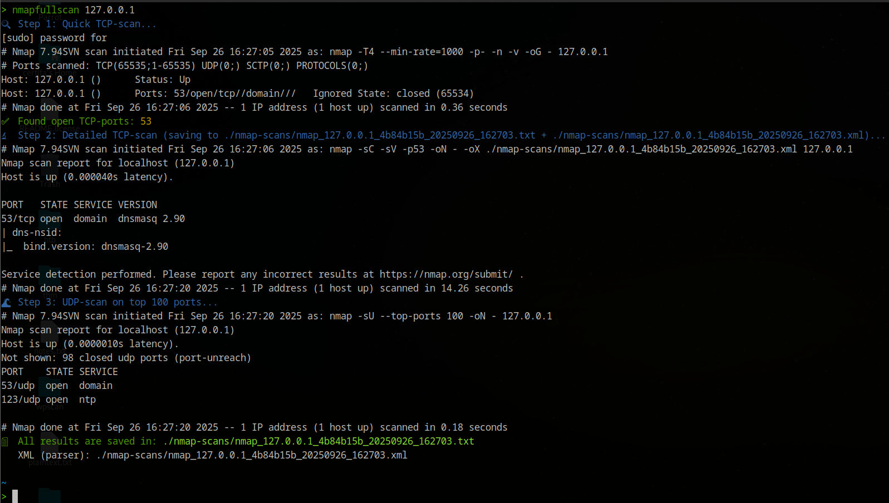

# nmapfullscan

A lightweight Python tool for fast and reliable Nmap scans with enhanced readability and safe results saving. Perfect for local labs and authorized testing environments.

---

## Overview

`nmapfullscan.py` runs a two-step TCP scan workflow with colorized console output and added UDP scanning:

- **Step 1:** Quick TCP port sweep using `-sS` (SYN scan) on all ports with controlled timing parameters for a balance of speed and accuracy. Outputs grepable and XML files.
- **Step 2:** Targeted detailed scan (`-sC -sV`) on only the discovered open TCP ports for service/version detection.
- **Step 3:** Optional UDP top-100 port scan appended to results.
- All results are saved in timestamped files in `./nmap-scans/` by default, including human-readable text with color highlights and XML for machine parsing.
- Configurable scan speed profiles (`safe`, `balanced`, `fast`) allow control over timing aggressiveness and retries for more reliable detections.

---

## Usage

Flow:

- Quick TCP sweep (`nmap -T4 --min-rate=1000 -p- -n -v -oG -`) to find open ports
- Parse open ports from grepable output
- If open ports exist → `nmap -sC -sV -p<ports>` saved to the final text file (and XML if configured)
- Append `nmap -sU --top-ports 100` to the same text file

`python3 nmapfullscan.py <IP or hostname> [--no-udp] [--output-dir <directory>] [--profile safe|balanced|fast]`

---

## Example

---

## Files in this repo
**nmapfullscan/**
- ├─ nmapfullscan.py # the main Python tool
- ├─ README.md # you are reading it
- └─ .gitignore # recommended ignore rules

---

## Key Improvements in This Version

- Robust parsing of open ports strictly from Nmap's grepable output `Host: ... Ports:` line.
- Avoids brittle regex on free text output which caused missed detections.
- Simultaneously outputs XML files to retain full machine-readable scan data.
- Reduced overly aggressive default timing settings to minimize missed open ports.
- Maintains original colorful and categorized console output for easy reading.
- Modular UDP scanning with option to skip.

---

## Requirements

- Python 3.8+
- `colorama` Python package (for terminal colors)
- Nmap installed and accessible in your system PATH

---

## Install (quick)

1. Clone this repo:
   `git clone https://github.com/Certifa/nmapfullscan.git`
2. Optionally, create an alias for easier use:
   `alias nmapfullscan='python3 /full/path/to/nmapfullscan.py'`
3. Reload your shell or `.zshrc`:
   `source ~/.zshrc`

---

### Safety Note

Only scan systems you have explicit permission to test. Unauthorized scanning is illegal and can cause harm.

---

## Legal Disclaimer

Use this tool responsibly. The author is not liable for misuse.

---

## Contribution

Feel free to fork, raise issues, or submit pull requests on GitHub.

---

> **Disclaimer:** This tool is provided for educational and authorized testing only. The author accepts no liability for misuse.
